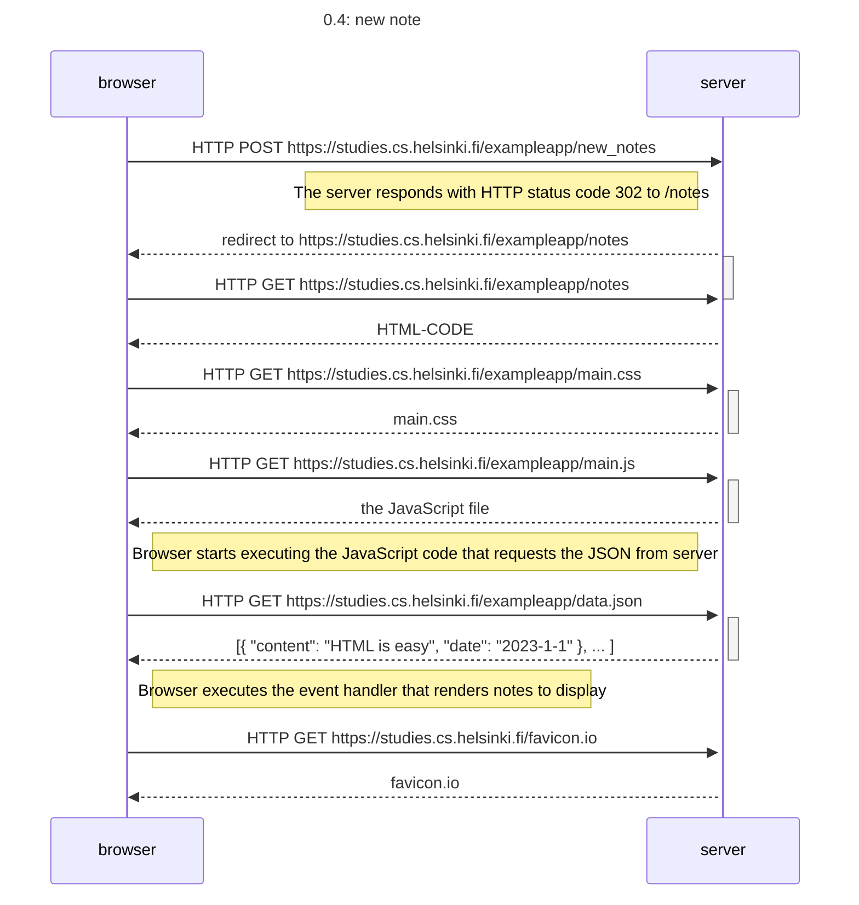

# 0.4: new note

```mermaid
sequenceDiagram
    Title: 0.4: new note

    browser->>server: HTTP POST https://studies.cs.helsinki.fi/exampleapp/new_notes
    activate server
    Note left of server: The server responds with HTTP status code 302 to /notes
    server-->>browser: redirect to https://studies.cs.helsinki.fi/exampleapp/notes
    activate server
    browser->>server: HTTP GET https://studies.cs.helsinki.fi/exampleapp/notes
    deactivate server

    server-->>browser: HTML-CODE
    activate server
    browser->>server: HTTP GET https://studies.cs.helsinki.fi/exampleapp/main.css
    activate server
    server-->>browser: main.css
    deactivate server

    browser->>server: HTTP GET https://studies.cs.helsinki.fi/exampleapp/main.js
    activate server
    server-->>browser: the JavaScript file
    deactivate server

    Note right of browser: Browser starts executing the JavaScript code that requests the JSON from server

    browser->>server: HTTP GET https://studies.cs.helsinki.fi/exampleapp/data.json
    activate server
    server-->>browser: [{ "content": "HTML is easy", "date": "2023-1-1" }, ... ]
    deactivate server

    Note right of browser: Browser executes the event handler that renders notes to display

    browser->>server: HTTP GET https://studies.cs.helsinki.fi/favicon.io
    activate server
    server-->>browser: favicon.io
```
