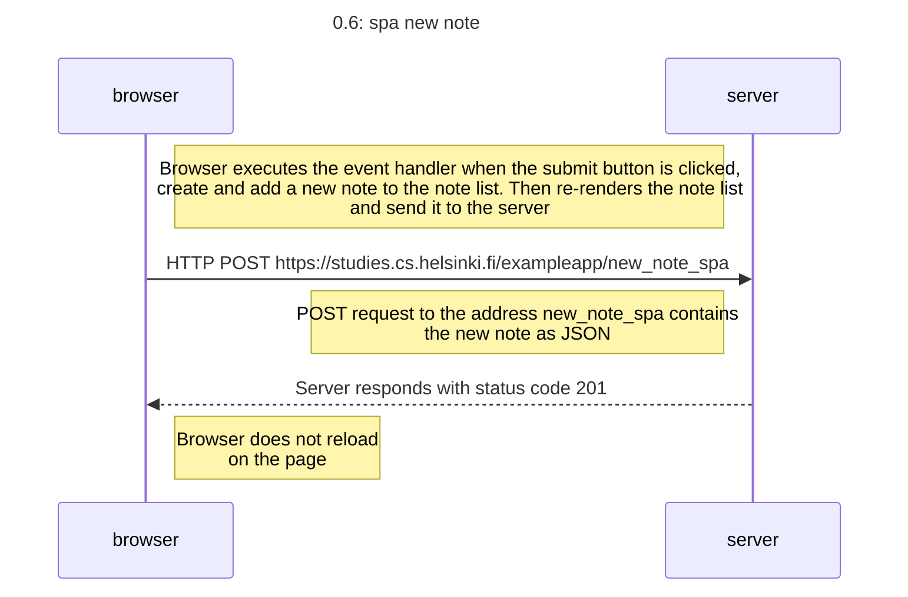

# 0.4: new note

```mermaid
sequenceDiagram
    Title: 0.6: spa new note

    Note right of browser: Browser executes the event handler when the submit button is clicked, <br>create and add a new note to the note list. Then re-renders the note list <br>and send it to the server

    browser->>server: HTTP POST https://studies.cs.helsinki.fi/exampleapp/new_note_spa

    Note left of server: POST request to the address new_note_spa contains <br> the new note as JSON

    server-->>browser: Server responds with status code 201
    activate server

     Note right of browser: Browser does not reload <br> on the page
```
